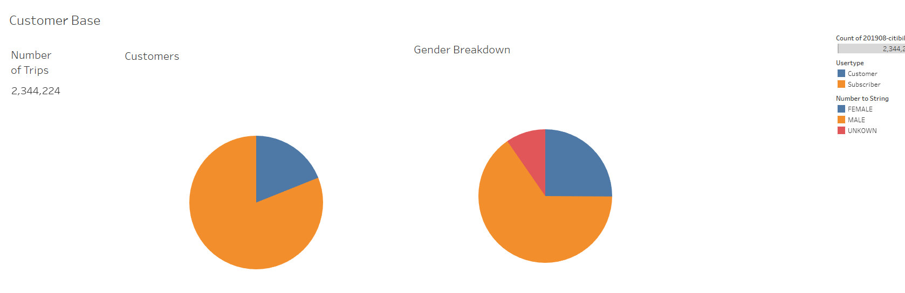
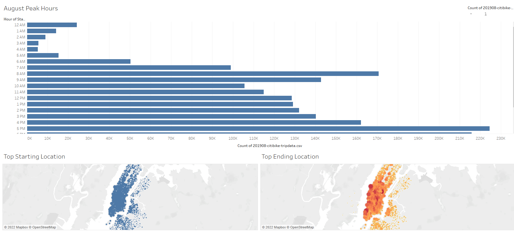
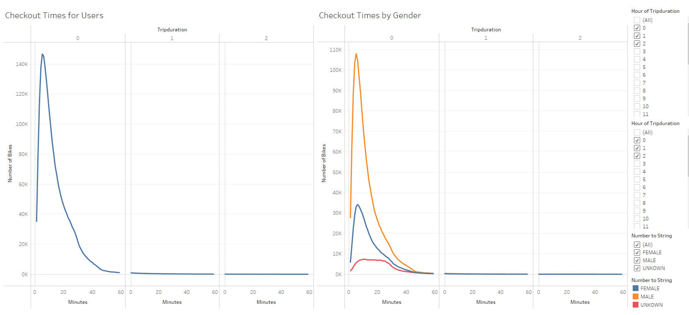
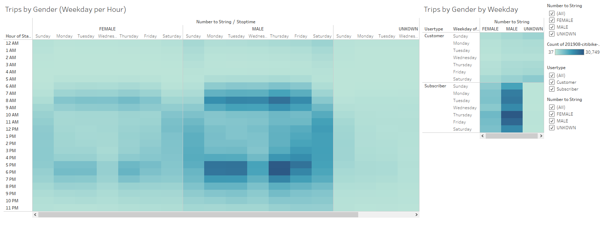

# Bikesharing

## Overview of The Analysis
The purpose of this analysis is to create a story board on Tableau with visuals that reveal important data on a potential bike-sharing program that investors can invest in. 

The Tableau Story answers the questions of:

1. Who the users are (Customers, Subcribers, Gender)
2. When are the peak hours and locations
3. Checkout times by User and Gender
4. The concentration of Hours and Days sustomers (Female and Male) use the bike.

## Results

### User Base

The above image reveals the user base for the NYC bike share program. A large percentage of the users are frequent user (Subscribers) and the predominant users are male. 

### Peak Hour/Location

The above image reveals that hours at which the bikes are used most often as well as the concentration of bike starting and ending locations. 

### Checkout Times

The above image reveals the length and amount of bikes checkout by the different users. 

### Trips by User Base

The image above reveals at which days and times the bikes are most frequently used by which user base. 

## Summary

Overall, the visuals created through Tableau help the investors understand the popularity of the bike share program in NYC. The graphs reveal a few conclusions:

1. The users of bike share programs are largely subcribers which means they are frequent users. this is great for investors to see as it means users who are constantly using the product. We also see that the largest user base are male, which will help in advertising the product. 

2. The Peak hours for bike usage reach its peak around 5pm - 6pm, which means that the user are those who are most likely commuting to and from work. The concentration of users are also located within the city limits, which shows where most of the bikes should be placed for maximum usage. 

3. Checkout times and duration of usage is important to understand as it help investors know how frequently and how long customers use the product. The heat map also shows which days and times users are most likely the use the product. 

## Additional Visualization for Future Analysis

1. Some other analysis we could perform are graphs that show the relation between the age and gender of the users to see if there were any useful pieces of information that could help better understand the user base. 

2. If the data exists, we could also incorporate data from other months to see which months see higher usage and also determine how weather factors into the frequency of use. 